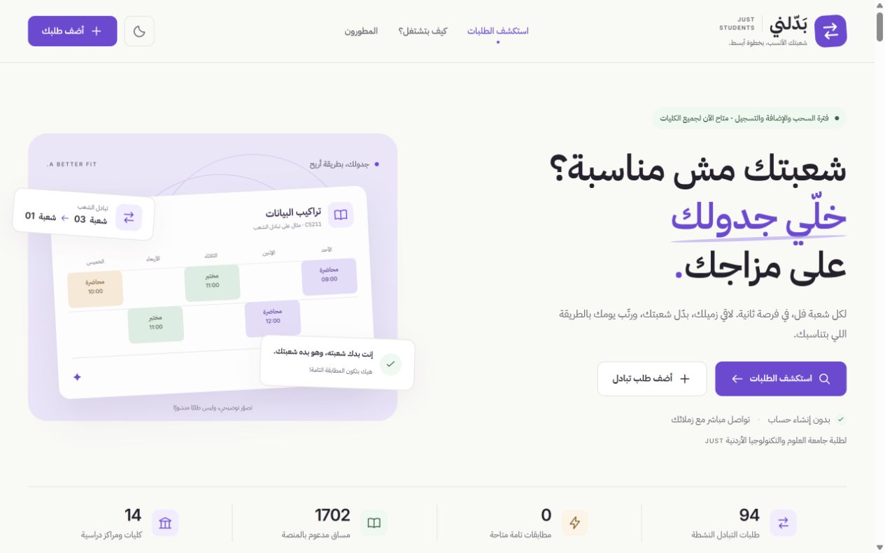

# Badlny | بَدّلني

A student-built, Arabic-first platform that helps students at Jordan University of Science and Technology (JUST) find classmates who want to exchange course sections.

[Live website](https://badlny.netlify.app/) · [العربية](README.ar.md) · [Architecture](docs/ARCHITECTURE.md) · [Security](SECURITY.md)

[](https://github.com/aboodalsharo/badlny/actions/workflows/ci.yml)



## The problem

A full section or an inconvenient lecture time can make a student's timetable difficult to manage. Badlny makes exchange requests easier to discover: a student lists their current section and the sections they want, then contacts a matching classmate. The actual registration change follows the university's own procedures.

This is an independent student initiative, not an official university registration system. A match does not reserve a seat or guarantee an exchange.

## Features

- Arabic RTL interface with responsive layouts and light/dark themes.
- Cascading college, department, course, and section filters; search by name, code, or line number.
- A public course catalog covering **1,702 courses and 14 colleges/centers** in this snapshot.
- Reciprocal matching: each student has the section the other student wants.
- Request creation without an account and request-specific password verification for deletion.
- Contact-on-demand rather than phone numbers in the public listing response.
- Keyboard-operable dialogs, focus restoration, and reduced-motion support.
- A registration-status badge scheduled to close on **17 October 2026 at 23:59 Asia/Amman**. This is display-only and uses the device clock.

## Stack

| Layer | Technology |
| --- | --- |
| Interface | Semantic HTML, CSS, vanilla JavaScript |
| Server API | TypeScript Netlify Functions |
| Hosted database | Supabase PostgreSQL |
| Optional local database | PostgreSQL 17 in a loopback-bound Docker container |
| Checks | Node.js test runner, GitHub Actions, repository exposure guard |

Keeping the interface framework-free makes the data flow and server/client boundary easy to inspect. The API verifies course metadata on the server rather than trusting client-supplied labels.

## Run locally — no production access needed

Requires Node.js **22.13+** and pnpm **11.22.0**. CI uses Node.js 24.

```sh
git clone https://github.com/aboodalsharo/badlny.git
cd badlny
pnpm install --frozen-lockfile --ignore-scripts
pnpm preview
```

Open **http://127.0.0.1:4173/**. This mode stores requests only in process memory and does not connect to production Supabase. Stopping the server clears these local samples.

Optional, in a second terminal after starting an empty local preview:

```sh
node scripts/seed-design-preview.mjs
```

The sample names are explicitly marked as test requests. Their phone number is a dummy value and their request password is `demo2026`; neither is a real account credential.

For persistent local testing, see [local development](docs/LOCAL-DEVELOPMENT.md). No hosted database rows or credentials are included in this repository.

## Verify changes

```sh
pnpm build
pnpm test
pnpm check:repository
```

The build regenerates the server catalog and copies an explicit allowlist into `public/`. Tests cover signed sessions, CSRF/origin checks, request validation, response privacy, rate limits, deletion verification, registration timing, and the repository exposure guard. They use mocks/synthetic fixtures, not the hosted database.

GitHub Actions runs these checks without Supabase or Netlify secrets. It does **not** deploy to production.

## Repository map

```text
index.html / app.js / redesign.css    Arabic interface and interactions
coursesData.js                       Public academic catalog, not student records
availability.js                      Registration-status timing
netlify/functions/                   Protected production API and security helpers
scripts/                             Build, local preview, importer, exposure checks
supabase/migrations/                 Empty, local-only PostgreSQL schema
tests/                               Offline automated tests
docs/                                Architecture and safe setup guides
```

## Security boundaries

Secret keys and session signing secrets belong only in the host's private environment. Public API paths and project URLs are not secret credentials. Phone numbers and password hashes are excluded from listing responses; a contact action intentionally reveals a number to an interested visitor.

This password-based, account-free model has trade-offs: simple request passwords are allowed, so they can be guessed. Limits reduce attempts, not eliminate risk. Read [SECURITY.md](SECURITY.md) before deployment or contributing. The repository guard is a heuristic safety check, not a complete security audit.

The hosted function is deliberately restricted to the original application's Supabase project and Netlify host. Forks must configure **their own** database, credentials, and reviewed host allowlist. Do not apply the local SQL files to production. See [deployment notes](docs/DEPLOYMENT.md).

## Project team

- **عبد الرحمن الشرع** — [@aboodalsharo](https://github.com/aboodalsharo)
- **عمران سريحين** — [@omrandro12-dotcom](https://github.com/omrandro12-dotcom)

Badlny is jointly developed and maintained by Abdul Rahman Alshara and Omran Sraihin as a student project.

## Project status

The redesigned interface was published on 30 September 2026. See [CHANGELOG.md](CHANGELOG.md). This repository starts from a reviewed source snapshot; it does not fabricate earlier commits or contribution history.

No open-source license has been selected. Public visibility alone is not a license to reuse or redistribute the code. Contact the developers about reuse.
