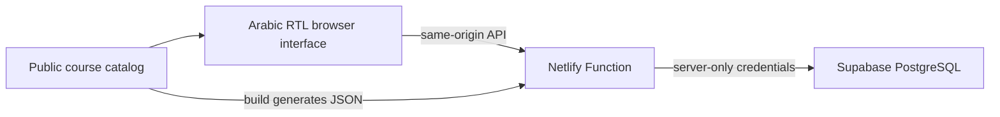

# Architecture

## Browser

`app.js` renders listings, filters requests, calculates reciprocal matches, and manages dialogs. Browser-local request IDs are a convenience for the “My requests” view; they are not deletion authorization. The public course catalog has academic metadata and section numbers, not student registrations.

## Server

`netlify/functions/swap-api.mts` serves `/api/session`, `/api/requests`, `/api/contact`, and `/api/delete`. It reads privileged secrets from Netlify's server environment, validates input, resolves course metadata from the built catalog, checks origin/CSRF/session integrity, and applies limits before sensitive actions.

The public list uses an explicit safe-field allowlist. Contact lookup is a separate, rate-limited action. Creation and deletion use protected database RPCs. The frontend cannot supply arbitrary database metadata or delete solely by knowing a request ID.

## Database and local modes

Production uses the existing hosted Supabase project. This repository contains no hosted rows or credentials. The included migrations are for an empty local PostgreSQL database only.

`pnpm preview` uses an in-memory loopback API. `pnpm preview:db` uses a separate loopback PostgreSQL service. Neither is a proxy to production. Tests mock database responses and do not connect to either real database.

## Trust boundaries

Treat listing text as untrusted and escape it before rendering. Keep secrets on the server. Public API URLs are discoverable; access checks, not hidden routes, enforce authorization. Keep deployment credentials out of CI and untrusted pull requests.
